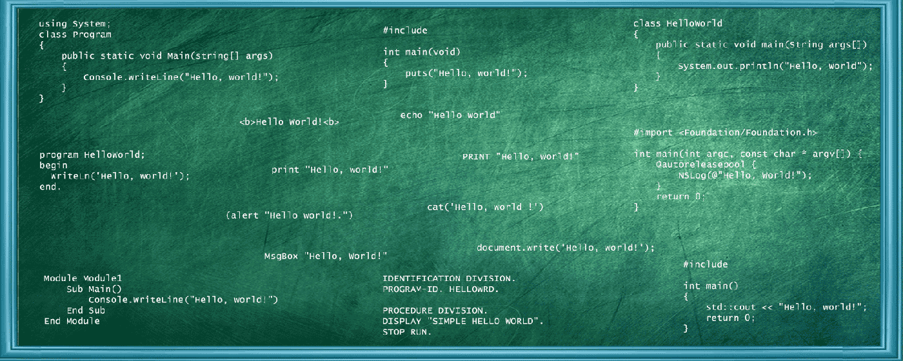

<!--
**eranavel/eranavel** is a ✨ _special_ ✨ repository because its `README.md` (this file) appears on your GitHub profile.

Here are some ideas to get you started:

- 🔭 I’m currently working on ...
- 🌱 I’m currently learning ...
- 👯 I’m looking to collaborate on ...
- 🤔 I’m looking for help with ...
- 💬 Ask me about ...
- 📫 How to reach me: ...
- 😄 Pronouns: ...
- ⚡ Fun fact: ...
-->

 

###Hey there 

 

I am <B>Eranavel Erana</B>, I enjoy programming and architect solution for business process. My journey is going strongly for more than 2 decades. I experienced the transformation in technology and love to continue this. 

<h3>🔭 I’m using these</h3>
####Programming Languages
          

####Frameworks and Libraries
         

####Databases
      

####Others

      

<h3>👯 I’m looking to collaborate with</h3>
    <ul>
    <li>community who likes to experiment on technology tools and platforms</li>
    <li>community who wants map technology with business innovation</li>
    </ul>
<h3>💬 Ask me about</h3>
    <ul>
    <li>New technology - techniques, tools, platforms and frameworks. I always like to learn so i may learn to help</li>
    <li>Application of Technology in Financial Domain mainly in Capital Market, Mutual Fund and Portfolio Management</li>
    </ul>
<h3>📫 How to reach me</h3>

          

<!-->
<h2>🔭 I’m currently working on</h2>
<ul>
<li>flutter</li>
<li>react native</li>
</ul>
<h2>💻 I'm Currently Learning</h2>
<h2>🤔 I’m looking for help with</h2>
Want to connect Kafka server running in Linux from AIX Client, Tried to get help from confulence but it is not officially available. 
